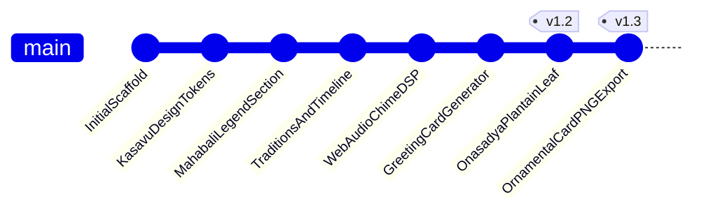

# Engineering Analysis & Architectural Specification — Onam 2026

## 1. Project Overview & Design System

A high-fidelity static web tribute to **Onam (കേരളോത്സവം)**. Built strictly with semantic HTML5, Vanilla CSS custom properties, and modern JavaScript (ES6+), optimized for instant load times, zero runtime dependencies (except CDN canvas-confetti), and rich cultural aesthetics.

### Color Tokens & Typography

```css
:root {
  --gold-primary: #D4AF37;
  --gold-light: #F7E7A9;
  --gold-dark: #A27B13;
  --gold-glow: rgba(212, 175, 55, 0.35);

  --cream-bg: #FAF9F5;
  --cream-surface: #FFFDF9;
  --cream-card: #FFFFFF;
  --cream-border: #EFE8DA;

  --maroon-deep: #701018;
  --maroon-rich: #8B1A24;
  --maroon-light: #A32834;

  --leaf-green: #206E34;
  --leaf-green-dark: #144922;
  --leaf-green-light: #2E8B47;
  --leaf-bg: #EDF7EE;

  --charcoal-dark: #1E1A16;
  --font-display: 'Rozha One', 'Cinzel', serif;
  --font-heading: 'Cinzel', serif;
  --font-sans: 'Plus Jakarta Sans', system-ui, sans-serif;
  --font-malayalam: 'Gayathri', 'Cinzel', serif;
}
```

---

## 2. Architectural Subsystems

```
+-----------------------------------------------------------------------------------------+
|                                  Onam 2026 DOM Tree                                     |
+-----------------------------------------------------------------------------------------+
     |
     +---> [Hero Section] -----------> [Countdown Clock & Flower Shower CTA]
     |
     +---> [Legend & Lore] ----------> [King Mahabali & Vamana Narrative Cards]
     |
     +---> [Traditions Grid] --------> [Athapookkalam, Vallam Kali, Pulikali, etc.]
     |
     +---> [Onasadya Feast Module] --> [Dual-View Switcher: Photo View & Dish Guide]
     |                                 ├── [Photo Mode: onasadya-leaf.jpg]
     |                                 └── [Guide Mode: Interactive Dish Grid & Lore]
     |
     +---> [10 Days Timeline] -------> [Atham -> Thiruvonam Day Progression]
     |
     +---> [Cultural Gallery] -------> [Kathakali, Pulikali, Snake Boat, Sadya Leaf]
     |
     +---> [Ornamental Card Engine] -> [Live Preview, Theme/Aspect/Ornament Selectors]
     |                                 ├── [DOM Preview with SVG Lotus Filigrees & Seals]
     |                                 ├── [High-Res HTML5 Canvas 2D Engine (1600x1200)]
     |                                 └── [PNG File Exporter, WhatsApp & Clipboard API]
     |
     +---> [Web Audio DSP Core] -----> [Procedural Temple Bell & Chime Synthesis]
```

---

## 3. Chronological Architectural Evolution



### Milestone: Ornamental Card Decoration & High-Res PNG Export (`v1.3`)
- **Ornamental Card Architecture**:
  - **Kasavu Zari Brocade Borders**: Multi-layered gold metallic gradients, Kasavu geometric diagonal weave hatching, inner hairline border, and dashed accent frame.
  - **4-Corner Lotus Filigrees**: Intricate SVG vector corner flourishes and canvas procedural paths framing the card content.
  - **Top Centerpiece**: Brass Nilavilakku (oil lamp) with dynamic glowing flame aura, paired with a curved Marigold (Chendumalli) and Jasmine flower garland swag.
  - **Athapookkalam Watermark**: Concentric floral mandala with 12-point radial petals positioned at center depth.
  - **Royal Seal Stamp Medallion**: Embossed circular golden medal (`👑 PONNONAM 2026`) with gold starburst.
- **Client-Side High-Resolution HTML5 Canvas PNG Engine & Proportional Aspect Ratio Preservation**:
  - Direct procedural Canvas 2D rendering pipeline (1600x1200 Landscape 4:3, 1400x1400 Square 1:1, 1080x1440 Portrait 9:12 / 3:4) with 0 external rasterization dependencies.
  - **Proportional Vertical Budgeting**: Replaced static Y-offsets with dynamic vertical space calculations mirroring DOM Flexbox `justify-content: space-between`:
    $$\text{Middle Center } Y = \text{TopSectionBottom} + \frac{(\text{FooterTop} - \text{TopSectionBottom})}{2}$$
    $$\text{WishStart } Y = \text{Middle Center } Y - \frac{\text{TextBlockHeight}}{2}$$
  - Dynamic font measurement, auto text-wrapping across varying widths, and proportional scaling of motifs (`scale = \min(\frac{W}{1600}, \frac{H}{1200})`).
  - Instant PNG export (`Onam-Greeting-Card-2026-[theme]-[aspect].png`) synchronized with Web Audio bell chimes and Canvas Confetti flower showers.
- **Site-Wide Ornamental Harmony**: Added subtle gold accents and corner stars to Tradition, Legend, and Timeline cards.

### Milestone: Onasadya Plantain Leaf Integration (`v1.2`)
- **Asset Integration**: High-definition, top-down flatlay photo (`onasadya-leaf.jpg`) depicting the complete 26-dish feast on a fresh banana leaf (*Thalavazha Ila*), featuring Kerala Matta rice, Parippu & ghee, Payasam bowls, Avial, Olan, Thoran, Pappadam, and crisp banana chips.
- **Dual-View State Switching**: Tabbed interface permitting users to toggle between the **Photorealistic Leaf View** and the **Interactive Dish Guide**.
- **Dish Matrix Expansion**: Expanded dish taxonomy with Matta Rice with Ghee & Parippu, Ada Pradhaman / Palada Payasam, Avial, Varutharacha Sambar, Olan, Injipuli, Thoran, Upperi Chips, Sharkara Varatti, Pappadam, and Pineapple Pachadi.
- **Cultural Gallery Enrichment**: Added the Grand Onasadya Leaf card to the visual tapestry gallery with confetti triggers.

---

## 4. Procedural Audio Synthesis (Web Audio API)

Temple bells and celebratory chimes are synthesized procedurally without external audio assets using a two-stage decaying sine oscillator and gain envelope:

$$\text{Gain}(t) = G_0 \cdot e^{-t / \tau}$$

```javascript
function playFestiveChime() {
  const AudioContext = window.AudioContext || window.webkitAudioContext;
  if (!AudioContext) return;
  const ctx = new AudioContext();

  const frequencies = [523.25, 587.33, 659.25, 783.99, 880.00, 1046.50]; // Mohanam raga series
  frequencies.forEach((freq, idx) => {
    setTimeout(() => {
      const osc = ctx.createOscillator();
      const gain = ctx.createGain();

      osc.type = 'sine';
      osc.frequency.setValueAtTime(freq, ctx.currentTime);

      gain.gain.setValueAtTime(0.3, ctx.currentTime);
      gain.gain.exponentialRampToValueAtTime(0.0001, ctx.currentTime + 1.8);

      osc.connect(gain);
      gain.connect(ctx.destination);

      osc.start();
      osc.stop(ctx.currentTime + 1.8);
    }, idx * 180);
  });
}
```

---

## 5. Performance & Quality Metrics

| Component | Target Metric | Architectural Approach |
| :--- | :--- | :--- |
| **First Contentful Paint (FCP)** | `< 0.6s` | Zero heavy frameworks; inline critical CSS; preconnected Google Fonts. |
| **Interaction to Next Paint (INP)** | `< 50ms` | Direct DOM manipulation for tabs and dish selections with no layout thrashing. |
| **PNG Render Latency** | `< 120ms` | Direct Canvas 2D blitting at 1600x1200 with vector path caching. |
| **Memory Footprint** | `< 25MB` | Offscreen canvas elements dereferenced immediately post blob export. |
| **Asset Size** | Compressed | SVG-based vector decorations + responsive, optimized JPG leaf photography. |
